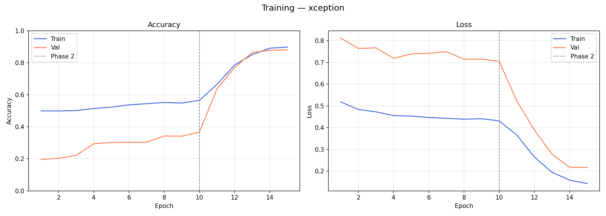
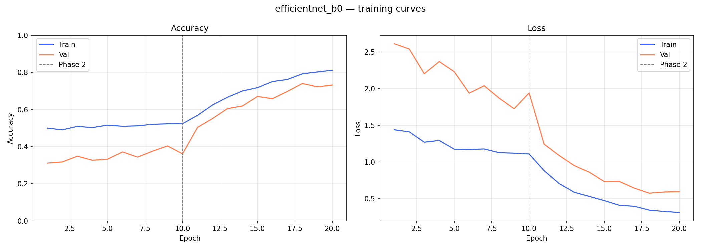
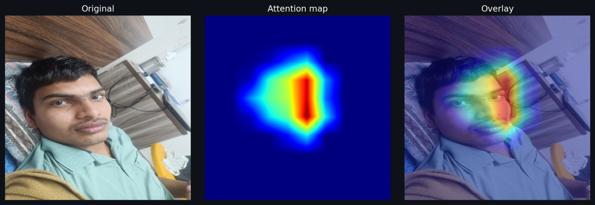
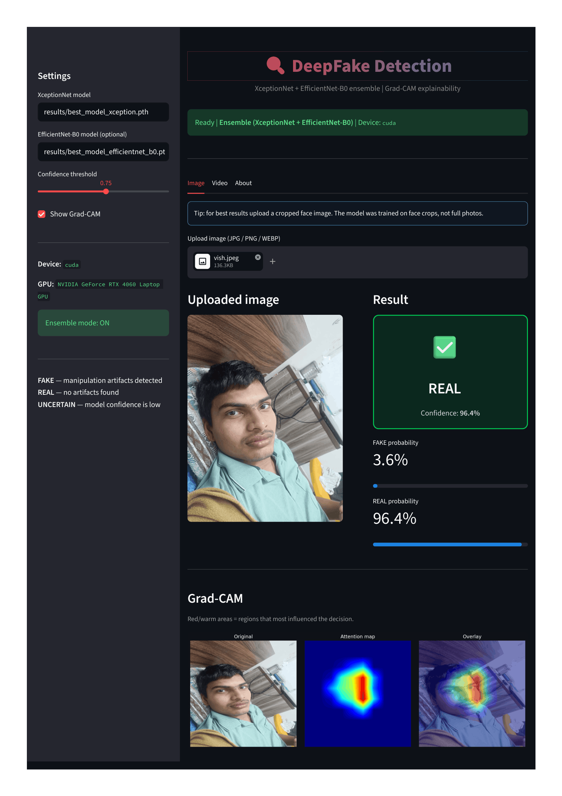

# Deepfake Detection using XceptionNet + EfficientNet-B0

A computer vision project that detects AI-generated face manipulations (deepfakes) using deep learning. Built with PyTorch and trained on the Kaggle Deepfake Detection Challenge dataset.

---

## What this project does

Given an image or video of a face, the model predicts whether it is **REAL** or **FAKE** (AI-generated). It also shows a Grad-CAM heatmap highlighting which parts of the face the model focused on to make that decision.

The pipeline:
1. Face images are extracted from videos using OpenCV's Haar Cascade detector
2. Two models are trained separately — XceptionNet and EfficientNet-B0
3. During inference, both models' probability scores are averaged (ensemble)
4. If the confidence is below a threshold, the result shows as UNCERTAIN instead of making a wrong prediction

There's also a Streamlit web app where you can upload images or videos and see results + heatmaps in your browser.

---

## Why I chose these models

**XceptionNet** uses depthwise separable convolutions instead of standard convolutions. This makes it more parameter-efficient while being really good at detecting subtle spatial patterns — which is exactly what deepfake artifacts are. The original deepfake detection literature (FaceForensics++ paper by Rossler et al.) used XceptionNet as their baseline, so it made sense to start here.

**EfficientNet-B0** uses compound scaling — scaling depth, width, and resolution together rather than separately. It generalises better across different types of deepfakes and complements XceptionNet because they have different architectures and learn different features. Averaging their predictions reduces false positives compared to using either alone.

I tried EfficientNet-B4 first but it needs a much larger dataset to converge properly (it has 19M parameters vs B0's 5.3M). B4 was stuck at 28% val accuracy after 10 epochs, so I switched to B0 which trained much more cleanly.

---

## Results

| Model | Val Accuracy | Epochs | Notes |
|---|---|---|---|
| XceptionNet | 90.1% | 15 | Strong baseline |
| EfficientNet-B0 | ~65–70% | 15–20 | More conservative, improves ensemble stability |
| Ensemble | More stable predictions | — | Reduces false positives |

Dataset: ~4586 fake + 1126 real face images extracted from Kaggle DFDC train_sample_videos

Training curves:






> Note: The jump between epoch 10 and 11 is when Phase 2 fine-tuning starts (unfreezing all layers with a 10x lower learning rate).


GradCam Demo:




Streamlit Web App:




---

## Project structure

```
deepfake-detector/
├── app.py               — Streamlit web app
├── train_dataset.py     — Training script (xception or efficientnet_b0)
├── predict.py           — CLI prediction, supports ensemble
├── gradcam.py           — Grad-CAM heatmap generation
├── extract_faces.py     — Extract face crops from videos
├── separate_videos.py   — Sort Kaggle videos by fake/real label
├── classes.txt          — Class list: fake, real
├── requirements.txt     — Python dependencies
│
├── dataset/
│   ├── fake/            — Extracted face images from fake videos
│   └── real/            — Extracted face images from real videos
│
└── results/
    ├── best_model_xception.pth
    ├── best_model_efficientnet_b0.pth
    ├── training_curves_xception.png
    └── training_log_xception.csv
```

---

## Setup

**Requirements:** Python 3.9–3.12, GPU recommended 

### 1. Install PyTorch with CUDA

Get the exact command for your system from [pytorch.org/get-started/locally](https://pytorch.org/get-started/locally).

For CUDA 12.1:
```bash
pip install torch torchvision torchaudio --index-url https://download.pytorch.org/whl/cu121
```

Check it works:
```bash
python -c "import torch; print(torch.cuda.is_available())"
# should print: True
```

### 2. Install other packages

```bash
pip install -r requirements.txt
```

---

## Getting the dataset

Download `train_sample_videos.zip` (~4 GB) from the [Kaggle DFDC competition page](https://www.kaggle.com/c/deepfake-detection-challenge/data).

Extract it.

Then run:
```bash

python separate_videos.py

# Extract face images
python extract_faces.py --video_dir raw_videos/fake_videos --output_dir dataset/fake --label fake
python extract_faces.py --video_dir raw_videos/real_videos --output_dir dataset/real --label real
```
---

## Training

```bash
# Train XceptionNet
python train_dataset.py dataset/ classes.txt results/ --model xception --epochs 15

# Train EfficientNet-B0 (for ensemble)
python train_dataset.py dataset/ classes.txt results/ --model efficientnet_b0 --epochs 15
```

---

## Running predictions

```bash
# Single image, XceptionNet only
python predict.py --model results/best_model_xception.pth --input test.jpg

# Single image, EfficientNet_b0 only
python predict.py --model results/best_model_efficientnet_b0.pth --input test.jpg

# Ensemble (both models)
python predict.py --model results/best_model_xception.pth \
                  --model2 results/best_model_efficientnet_b0.pth \
                  --input test.jpg

# Video
python predict.py --model results/best_model_xception.pth --input test.mp4 --video
```

---

## Grad-CAM

```bash
python gradcam.py --model results/best_model_xception.pth --input face.jpg
```

---

## Web app

```bash
streamlit run app.py
```

---

## Modifications from the original project

This project is a replication and extension of [i3p9/deepfake-detection-with-xception](https://github.com/i3p9/deepfake-detection-with-xception).

Things I added or changed:
- Migrated from TensorFlow/Keras to PyTorch + timm
- Added EfficientNet-B0 as a second model with ensemble averaging
- Added data augmentation that specifically targets generalisation: JPEG compression simulation (quality 40–95), Gaussian noise, and random blur — so the model doesn't overfit to one specific video codec
- Weighted random sampler + weighted loss to handle class imbalance (4:1 fake:real ratio)
- Two-phase transfer learning (head-only → full fine-tune)
- Grad-CAM explainability using backward hooks
- Confidence thresholding with UNCERTAIN output
- Video analysis with frame-level majority voting
- Streamlit web interface with image and video upload
- Training curves and CSV logging saved automatically

---

## Known limitations

The biggest issue is that the model was trained on compressed video frames from the Kaggle DFDC dataset. Real-world photos (phone camera shots, social media images) have different compression characteristics, so the model sometimes incorrectly classifies them as FAKE. This is a known problem in the deepfake detection literature — models trained on one dataset tend to overfit to that dataset's artifacts. Adding FaceForensics++ or Celeb-DF data would help with generalisation.

---

## Real-world behavior

While validation accuracy is high, performance varies on real-world images:

- Works best on face-cropped images similar to training data
- May misclassify low-quality or blurred real images as FAKE
- Ensemble may output UNCERTAIN when models disagree

This is due to domain shift between training data (compressed video frames) and real-world images.

This behavior is consistent with known challenges in deepfake detection research.

---

## References

- Chollet, F. (2017). Xception: Deep Learning with Depthwise Separable Convolutions. [arXiv:1610.02357](https://arxiv.org/pdf/1610.02357.pdf)
- Tan, M. & Le, Q.V. (2019). EfficientNet: Rethinking Model Scaling for CNNs. [arXiv:1905.11946](https://arxiv.org/abs/1905.11946)
- Selvaraju et al. (2017). Grad-CAM: Visual Explanations from Deep Networks. [arXiv:1610.02391](https://arxiv.org/abs/1610.02391)
- Rossler et al. (2019). FaceForensics++: Learning to Detect Manipulated Facial Images. [arXiv:1901.08971](https://arxiv.org/abs/1901.08971)
- Original project: [i3p9/deepfake-detection-with-xception](https://github.com/i3p9/deepfake-detection-with-xception)